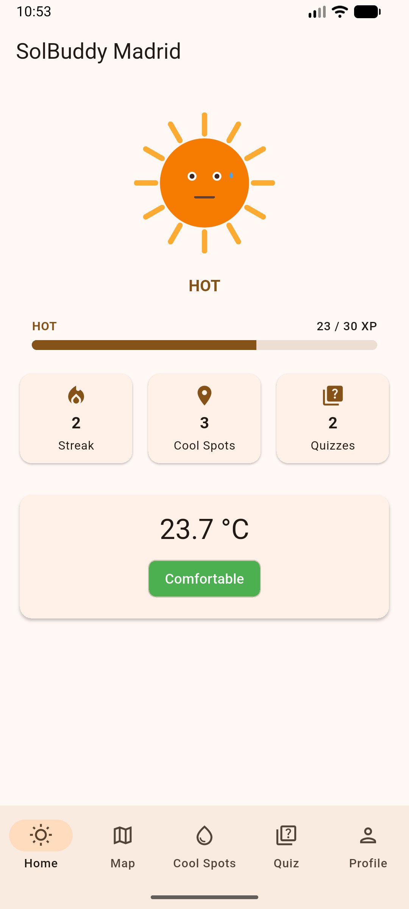
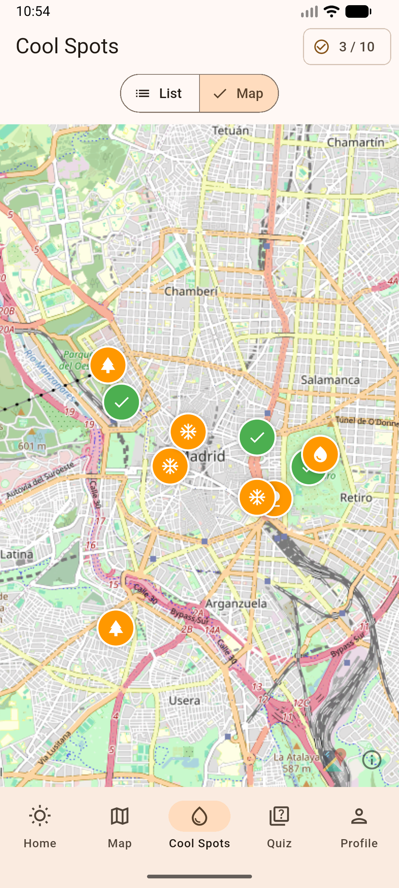
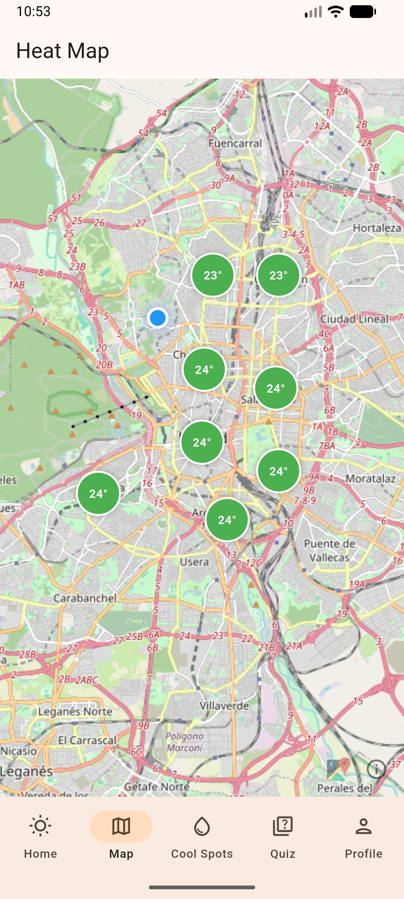
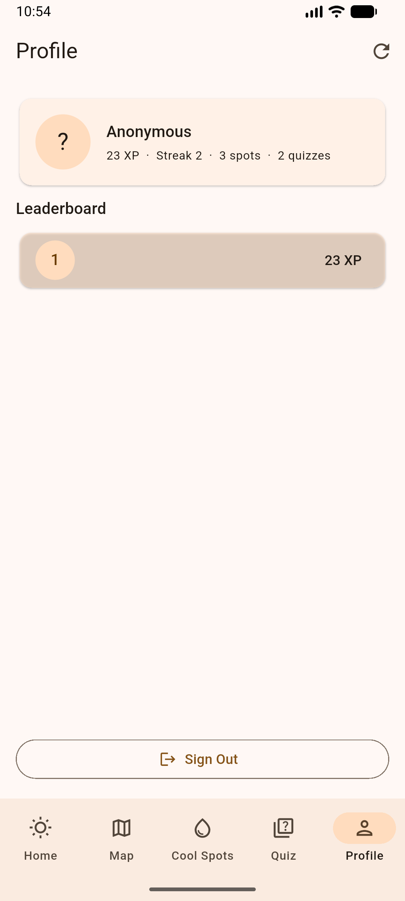

# SolBuddy Madrid

A gamified heat-awareness app that connects urban temperature, personal health risks, and cool refuges in Madrid through a virtual sun avatar that thrives or melts with the city's heat.


---

## Workspace

**Github:**
- Repository: https://github.com/Giorgos453/FlutterProject
- Releases: https://github.com/Giorgos453/FlutterProject/releases

**Workspace:** https://upm365.sharepoint.com/sites/FlutterProject

---

## Table of Contents

1. [About the Project](#about-the-project)
2. [The Climate Cube Concept](#the-climate-cube-concept)
3. [Features](#features)
4. [Screenshots](#screenshots)
5. [Tech Stack](#tech-stack)
6. [APIs Used](#apis-used)
7. [How to Use](#how-to-use)
8. [Demo Video](#demo-video)
9. [Project Structure](#project-structure)
10. [Game Mechanics](#game-mechanics)
11. [Authors](#authors)
12. [Acknowledgments](#acknowledgments)

---

## About the Project

**SolBuddy Madrid** is a gamified heat-awareness app where users care for a virtual sun avatar that reacts to real-time temperature data in Madrid. The hotter the city, the more the avatar suffers. When users take action — finding cool spots, learning about heat risks, staying consistent — Sol recovers and evolves through five distinct stages.

The core gameplay loop is simple: **high temperatures drain your Sol, your actions heal it.** Daily logins, eco-quizzes, and check-ins at real Madrid cool spots all reward XP that grows the avatar from a melting state to a radiant, fully thriving sun.

The app was built for the **Mobile App Development course** at **Universidad Politécnica de Madrid (UPM)**, taught by **Prof. Bernardo Tabuenca**. It follows the **Climate Cube Game** framework, which teaches students to design experiences that connect environmental problems, their human impact, and concrete solutions in a single coherent story.

Unlike generic weather apps that simply display a temperature number, SolBuddy Madrid translates abstract heat data into emotional stakes (your Sol's wellbeing), educational content (the eco quiz), and real-world action (visiting Madrid's cool refuges).

---

## The Climate Cube Concept

SolBuddy implements all three Climate Cube dimensions in a single, integrated experience:

### RED — Urban Heat (The Problem)

- Real-time temperature data from the **Open-Meteo API** (free, no key required)
- **District heat map** showing current temperature levels across 8 Madrid neighborhoods
- Temperature thresholds that trigger XP penalties: warm (28°C), hot (34°C), extreme (38°C)
- Location-based readings via GPS, with a Madrid fallback when no signal is available

### YELLOW — Health Risks (The Impact)

- Sol avatar **drains XP automatically** when temperatures are high
- Quiz questions about the health effects of urban heat and heat stroke
- Educational content explaining how prolonged heat affects the human body
- Health advice dynamically tied to the current temperature reading

### GREEN — Cool Spots (The Solution)

- Interactive map with **10 real Madrid locations** as discoverable cool refuges: parks, fountains, and air-conditioned public buildings
- Cool spot **check-in system** rewarding users with XP for visiting green and cool spaces
- Sol avatar that **grows** through environmental awareness actions
- Educational quiz covering urban cooling, heat adaptation, and sustainable habits

---

## Features

### Core Features

- **Sol Avatar System** — virtual companion with 5 heat stages (Melting, Hot, Warm, Cool, Radiant)
- **XP System** — unlimited progression with stage-based milestones
- **Daily Login Streak** — escalating bonus rewards for consecutive logins
- **Weather Integration** — current temperature and conditions via Open-Meteo (free, no key)
- **District Heat Map** — per-neighborhood temperature overview for 8 Madrid districts
- **Eco Quiz** — questions across the 3 Climate Cube categories with a daily play limit
- **Cool Spot Discovery** — 10 Madrid locations on the map, each rewarding a one-time check-in bonus
- **Leaderboard** — live Firestore-synced global ranking by XP

### Account & Profile

- **Firebase Authentication** (Email/Password)
- Customizable display name
- **Username management**
- **GPS location tracking** with live map updates

### Educational

- Quiz explanations after each answer, teaching heat and environmental facts
- Health advice based on current temperature conditions
- In-app visibility of how the Climate Cube concept connects heat, health, and cool spots

---

## Screenshots

### Home Screen

The main hub: Sol avatar status, XP and streak stats, and quick-access tiles to every feature.



### Cool Spots

All discoverable Madrid cool refuges in a list, each with a one-time check-in reward.



### Map & District Heat

Interactive map of Madrid showing all 10 discoverable cool spots and a per-district temperature overview.



### Eco Quiz

Questions across the three Climate Cube categories — one scored session per day.


### Leaderboard

Live, Firestore-synced global ranking ordered by total XP.



### Profile

Manage your username and track your personal stats.


---

## Tech Stack

| Layer | Technology |
|---|---|
| Language | **Dart** |
| Framework | **Flutter** |
| Architecture | **Provider** pattern |
| Remote Database | **Cloud Firestore** |
| Authentication | **Firebase Auth** (Email/Password) |
| Networking | **http** package |
| Maps | **flutter_map** (OpenStreetMap tiles) |
| Location | **geolocator** |
| State Management | **provider** |

---

## APIs Used

- **Open-Meteo Weather API** — free, no API key required. Provides real-time temperature, current conditions, and multi-location forecasts.
- **Cloud Firestore** — synchronizes user profiles, XP scores, visited cool spots, and the global leaderboard.
- **Firebase Authentication** — email/password account management.
- **OpenStreetMap** — map tiles rendered via flutter_map.

---

## How to Use

### Prerequisites

- Flutter SDK (3.11+) installed and on your `PATH`
- Android device/emulator (API 21+) or iOS device/simulator
- A Google account (for Firebase Auth)

### Setup

1. **Clone** the repository:
   ```bash
   git clone https://github.com/Giorgos453/FlutterProject.git
   ```
2. **Open** the project in Android Studio or VS Code.
3. Create a Firebase project at [console.firebase.google.com](https://console.firebase.google.com).
4. Register both an **Android** and an **iOS** app in the Firebase Console.
5. Download `google-services.json` and place it inside `android/app/`.
6. Download `GoogleService-Info.plist` and place it inside `ios/Runner/`.
7. In the Firebase Console, **enable Authentication** with the *Email/Password* provider.
8. **Enable Cloud Firestore** in the Firebase Console (test mode is fine for development).
9. Run `flutter pub get` to install dependencies.
10. **Build and run** the app:
    ```bash
    flutter run
    ```
11. On first launch, **register** with email and password.
12. **Grant the location permission** when prompted (required for GPS-based weather and the map).

### Notes

- Weather data works **immediately** without any API key — Open-Meteo is free and keyless.
- For emulator testing, set the location to Madrid (`40.4165, -3.7026`) via the emulator's location controls.

---

## Demo Video

*https://upm365.sharepoint.com/sites/KotlinProject/_layouts/15/stream.aspx?id=%2Fsites%2FKotlinProject%2FFreigegebene%20Dokumente%2FFinal%5FDemo%2Emov&referrer=StreamWebApp%2EWeb&referrerScenario=AddressBarCopied%2Eview%2E14b28ff2%2Dff8c%2D48bb%2Da1b9%2D5c745c0be867*

---

## Project Structure

```
lib/
├── core/
│   ├── constants.dart        # XP rewards/penalties, thresholds, cool spot list, district list
│   ├── quiz_questions.dart   # Full quiz catalog across 3 Climate Cube categories
│   └── theme.dart            # App-wide color scheme and text styles
├── firebase_options.dart     # Firebase configuration
├── main.dart                 # App entry point, auth gate, session init
├── models/
│   ├── cool_spot.dart        # Cool spot data class and type enum
│   ├── daily_check_result.dart  # Result model for daily login XP/penalty logic
│   ├── district.dart         # Madrid district coordinates
│   ├── district_weather.dart # Per-district temperature model
│   ├── heat_level.dart       # Heat level enum tied to temperature thresholds
│   ├── leaderboard_entry.dart # Leaderboard row model
│   ├── quiz_question.dart    # Quiz question model with Climate Cube category
│   ├── sol_stage.dart        # Sol avatar stage enum with XP thresholds
│   ├── user_model.dart       # Immutable user profile with XP and streak logic
│   └── weather_data.dart     # Weather API response model
├── providers/
│   ├── auth_provider.dart    # Firebase Auth state management
│   ├── map_provider.dart     # District weather and cool spot state
│   ├── user_provider.dart    # User profile, XP, daily check logic
│   └── weather_provider.dart # Current weather state
├── screens/
│   ├── auth/
│   │   ├── login_screen.dart    # Login screen
│   │   └── register_screen.dart # Registration screen
│   ├── cool_spots_screen.dart  # Cool spot list with check-in
│   ├── home_screen.dart        # Home hub with Sol avatar and stats
│   ├── main_screen.dart        # Bottom navigation shell
│   ├── map_screen.dart         # Interactive map with cool spots
│   ├── profile_screen.dart     # User profile and account management
│   └── quiz_screen.dart        # Eco quiz flow and summary
├── services/
│   ├── auth_service.dart       # Firebase Auth wrapper
│   ├── firestore_service.dart  # Firestore read/write operations
│   ├── location_service.dart   # GPS location wrapper
│   └── weather_service.dart    # Open-Meteo API client
└── widgets/
    ├── sol_avatar.dart         # Animated Sol avatar widget
    ├── stat_card.dart          # Reusable stat display card
    ├── state_views.dart        # Loading, error, and empty state widgets
    └── xp_bar.dart             # XP progress bar widget
```

---

## Game Mechanics

### Earning XP

| Action | XP Reward |
|---|---|
| Daily login (base) | +1 |
| Quiz: each correct answer | +2 |
| Quiz: perfect score bonus | +3 |
| Cool spot check-in (one-time per spot) | +5 |
| 7-day streak milestone | +10 |

### Losing XP

| Trigger | XP Penalty |
|---|---|
| Temperature above 34°C (daily) | −8 per day |
| Temperature above 38°C (daily) | −15 per day |
| Inactivity (3+ days without login) | −4 per day |

### Sol Stages

| Stage | XP Range |
|---|---|
| Melting | 0 – 9 |
| Hot | 10 – 29 |
| Warm | 30 – 59 |
| Cool | 60 – 99 |
| Radiant | 100+ (no upper limit) |

> **Daily quiz limit:** only one quiz session per day awards XP — this prevents farming and keeps engagement honest.

> **Live temperature penalty:** the displayed avatar stage reflects stored XP minus the current heat penalty in real time, so a hot Madrid day visibly affects your Sol even without an explicit XP deduction until the next daily check.

---

## Authors

- Giorgos Galatidis — giorgos.galatidis@alumnos.upm.es
- Murat Kockar — murat.kockar@alumnos.upm.es

**Universidad Politécnica de Madrid** — Mobile App Development Course. **Professor:** Bernardo Tabuenca.
Workload distribution between members: **50% / 50%**.

---

## Acknowledgments

- **Weather data:** [Open-Meteo](https://open-meteo.com) — free, open-source weather API (no key required)
- **Map tiles:** [OpenStreetMap](https://www.openstreetmap.org) contributors, rendered via [flutter_map](https://pub.dev/packages/flutter_map)
- **Backend:** [Firebase](https://firebase.google.com) — Cloud Firestore and Authentication
- **Course framework:** *Climate Cube Game* concept by Prof. Bernardo Tabuenca
